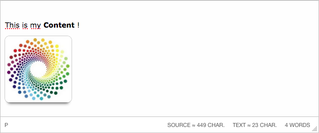

# TinyMCE 4 Characters Count Plugin

A lightweight character counter plugin for **TinyMCE 4**, displaying live character counts for editor content.



## Features

- Counts characters from:
  - **Rendered text content** (HTML stripped)
  - **Raw source content** (HTML included)
- Displays counters in the TinyMCE status bar
- Update is debounced to avoid congestion (configurable; default is 250 ms)
- Handles:
  - Normalized line breaks (`\r\n` → `\n`)
  - Non-breaking spaces (`&nbsp;` → space)
- Multilingual support (EN, FR, FR_FR). You can add your own translations in the `/langs` folder.
- Optional public API

## Compatibility

- TinyMCE **4.x**
- Tested with TinyMCE 4.9.0
- Not tested with TinyMCE 5+

## Installation

Copy the `characterscount` directory into your TinyMCE `plugins` folder:

```
tinymce/
└── plugins/
    └── characterscount/
```

## Initialization

```javascript
tinymce.init({
  selector: 'textarea',
  plugins: 'characterscount',
  statusbar: true
});
```

> The status bar must be enabled for the counter to be visible.

## Options

- `characterscount_debounce` : Delay before refreshing the counters (in ms)
- `characterscount_show_text` : Boolean to specify wether the TEXT counter should be included (`true|false` - default is set to `true`)
- `characterscount_show_source` : Boolean to specify wether the SOURCE counter should be included (`true|false` - default is set to `true`)

## Public API (Optional)

```javascript
var counts = tinymce.activeEditor.plugins.characterscount.getCounts();

console.log(counts.text);
console.log(counts.source);
```

Returned object:

```
{
  text: Number,
  source: Number
}
```

## Localization

Language files are located in:

```
characterscount/langs/
```

TinyMCE automatically loads the appropriate language based on the editor configuration.
Be careful about languages that can be used with or without region spécification (for example `fr` and `fr_FR`).
Simply duplicate the files to ensure a full compatibility with your locale.

## Styling

Status bar styles are defined in:

```
characterscount/css/ui.css
```

You may override these styles in your own stylesheet if needed.

## License

- GPL-3.0 license
- Please retain original Copyright.
